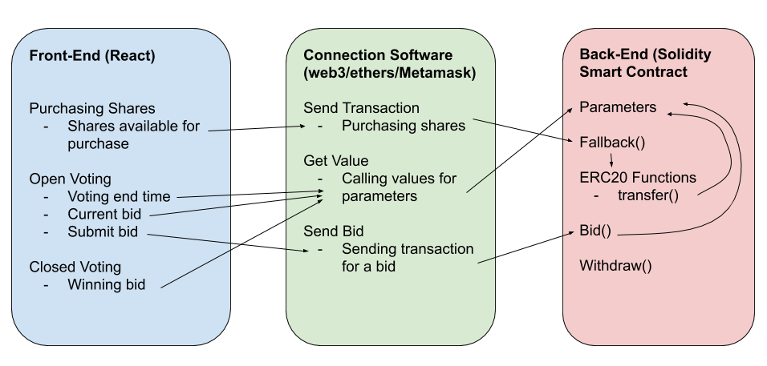

# Design Patterns for Blockchain

## BitBnB - Timeshare reservation token

Anushka Aggarwal  
Luka Buzaladze  
Deepanshu Gupta  
Aaron Lu  
Pratik Patil  
Karan Singh

---

### How to deploy and test
Software requirements:
- npm/react
- ganache/truffle
- Metamask

Instructions (assuming `npm install` has been run in the `react_front_end` and `solidity_back_end` folders):
1. Start ganache using `ganache-cli -d` (from any folder location)
1. Deploy the smart contracts using `truffle migrate` from the `solidity_back_end` folder
1. Connect Metamask to the `localhost:8545` network and login to an existing account using a ganache private key
1. Deploy the front end using `npm start` from the `react_front_end` folder

Notes:
- the biggest challenge in this project was syncing data from the solidity back end (if there was more time, a server would have been useful to implement)
- in this case, if something has not updated, try refreshing the page

---

### Functionality

- People are able to purchase fractional shares of property
- Every cycle (a certain number of weeks) they are allotted tokens to bid on weeks in that season
- Highest bidder wins the week to use the property

### Goal

This smart contract is a token that allows users to securely buy into and bid on weeks on which they would be able to use a timeshare property. There is a limited supply of tokens, which could be bought with ethereum which represent shares of the property. These tokens can be used to bid on weeks during each season (e.g. 4 months). Before each season, a voting phase is held. This voting phase consists of token owners bidding on a specific week in a season with tokens. By bidding, these tokens are not lost forever, but only for the current season. After the end of each season, everyone's balance is set to the amount of tokens they had before voting for it started. If shares are not completely sold, they can be purchased at any time as well.

### Data

| Name          | Type    | Structure                           | Visibility                               | Purpose                                                      |
| ------------- | ------- | ----------------------------------- | ---------------------------------------- | ------------------------------------------------------------ |
| openVoting    | bool    | n/a                                 | private                                  | track if voting is open or not                               |
| endTime       | uint    | n/a                                 | public                                   | time when voting closes or starts                            |
| allottedBids  | mapping | (address => uint)                   | public                                   | total number of bids allowed per address depending on shares |
| remainingBids | mapping | (address => uint)                   | public                                   | remaining bids left per address                              |
| Bid           | struct  | {address, amount}                   | n/a                                      | structure to contain bid & address information               |
| currentBid    | mapping | (uint => mapping (address => uint)) | track each users current bids for a week |
| highestBid    | mapping | (uint => Bid)                       | public                                   | track the highest bid per week (with data)                   |

### Functions

| Function name   | Parameters   | Description                                                                      |
| --------------- | ------------ | -------------------------------------------------------------------------------- |
| _`fallback`_    | None         | Used to purchase tokens(I.E. shares of the timeshare)                            |
| `bid`           | week, amount | Place bid of a certain number of tokens for a certain week                       |
| `withdraw`      | Amount       | An owner only function that allows them to withdraw money used for buying shares |
| ERC20 Functions | Many         | Used to call transfers, balances, etc                                            |
| `<parameters>`  | Many         | smart contract parameters that can be called for values (balances, endTime, etc) |

### Flowchart

### Type of Architecture

- _Token_ (allows for transferring, etc)
- Using openzepplin ERC-20 code as base (allows for using a pre-tested and reliable base)
- Can be customized & good for representing fractional ownership of property

### Task Division

| Task ID | Task Name                                      | Time Needed | Task Description                                                                                                                                                | Depends on | Assigned                                |
| ------- | ---------------------------------------------- | ----------- | --------------------------------------------------------------------------------------------------------------------------------------------------------------- | ---------- | --------------------------------------- |
| 1       | Write out project plan and architecture        | 2 Days      | Write the architectural document including flow diagrams for user stories, data definitions, time estimates, staff roles, dependency graphs, and cost estimates |            | Aaron & Luka                            |
| 2       | Implement the smart contract                   | 1 Day       | Implement the smart contract according to the documents above                                                                                                   | 1          | Aaron & Karanjot                        |
| 3       | Audit the smart contract                       | 4 Hours     | Audit the smart contract and find security flaws                                                                                                                | 2          | Aaron & Karanjot                        |
| 4       | Design the front-end interface                 | 2 Hours     | Design and create markup for the front end interface                                                                                                            | 1          | Luka & Anushka                          |
| 5       | Create the react application                   | 1 Day       | Create a react application specified in the project plan and architecture, and implement the created markup into the application                                | 4          | Luka & Anushka                          |
| 6       | web3/ethersJS/Metamask functionality           | 1 Day       | Write basic web3/ethers/metamask code for interacting with front-end & back-end                                                                                 | 1          | Deepanshu & Pratik                      |
| 7       | Integrate react application and smart contract | 2 Day       | Integrate the smart contract with the react application and do preliminary testing of the integration                                                           | 4,5,6      | Deepanshu & Pratik (everyone if needed) |
| 8       | Testing                                        | 2 Days      | Fully test the system(smart contract + react) and resolve all found bugs.                                                                                       | 6          | everyone write test cases               |
